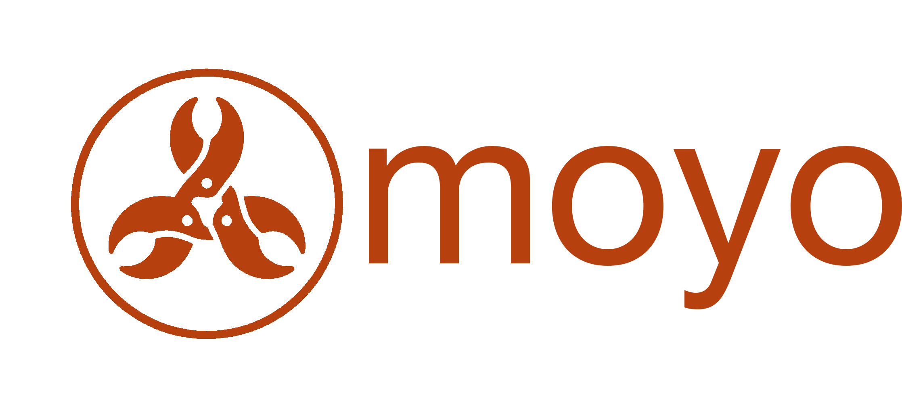
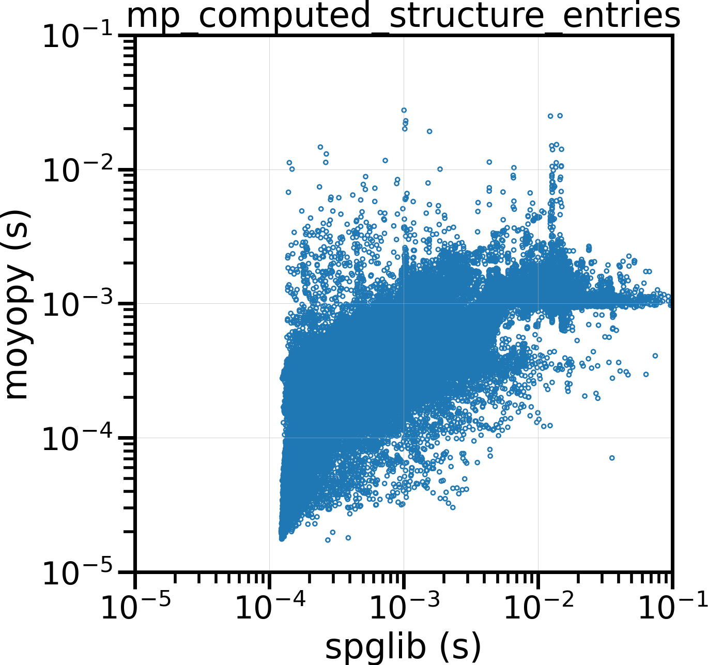

<div align="center">

# 

[](https://pypi.python.org/pypi/moyopy)
[](https://img.shields.io/crates/v/moyo)
[](https://pypi.python.org/pypi/moyopy)

</div>

A fast and robust crystal symmetry finder, written in Rust.

<figure>
    <div style="text-align: center">
        
    </div>
    <figcaption><a href="bench/mp/analysis.ipynb">Several times faster symmetry detection than Spglib for Materials Project dataset</a></figcaption>
</figure>

- Rust support available via [crates.io](https://crates.io/crates/moyo): [Docs](https://docs.rs/moyo/latest/moyo/)
- Python support available via [PyPI](https://pypi.org/project/moyopy/): [Docs](https://spglib.github.io/moyo/python/)
- JavaScript and WebAssembly support available via [npm](https://www.npmjs.com/package/@spglib/moyo-wasm)

## Interfaces

- [Rust](moyo/README.md): core implementation
- [Python](moyopy/README.md): Python binding
- [C](moyoc/README.md): C binding
- [JavaScript](moyo-wasm/README.md): JavaScript and WebAssembly binding

## How to cite moyo and its interfaces

If you use moyo or its interfaces in your work, please cite the following figshare entry.

```
@misc{moyo,
  author = {Kohei Shinohara},
  title  = {{moyo: A fast and robust crystal symmetry finder, written in Rust}},
  year   = {2026},
  month  = {1},
  doi    = {10.6084/m9.figshare.31081162.v1},
  url    = {https://figshare.com/articles/software/moyo_A_fast_and_robust_crystal_symmetry_finder_written_in_Rust_/31081162},
  note   = {Source code available at \url{https://github.com/spglib/moyo}}
}
```

This citation may be superseded by a peer-reviewed publication in the future.

## Dev

```shell
cargo install cargo-release cargo-edit cargo-deny cargo-semver-checks
```

### How to release

1. `cargo semver-checks` to lint a new release
1. `cargo set-version --bump patch` for patch version increment
1. Write change log and git-commit
1. `cargo release --execute` (If you already release the package in crates.io, run `cargo release --execute --no-publish`)

### Debugging

```shell
RUST_LOG=debug cargo test -- --nocapture
```

## Acknowledgments

We thank Dr. Yusuke Seto for providing the crystallographic database.
We thank Juan Rodríguez-Carvajal for providing the magnetic space-group database.
