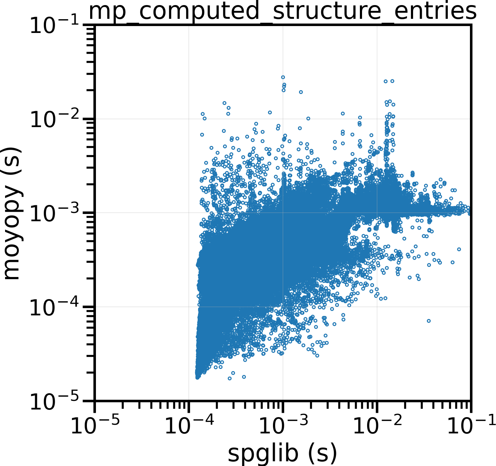

<div align="center">

# 

[](https://pypi.python.org/pypi/moyopy)
[](https://img.shields.io/crates/v/moyo)
[](https://pypi.python.org/pypi/moyopy)

</div>

A fast and robust crystal symmetry finder, written in Rust.

<figure>
    <div style="text-align: center">
        
    </div>
    <figcaption><a href="bench/mp/analysis.ipynb">Several times faster symmetry detection than Spglib for Materials Project dataset</a></figcaption>
</figure>

## Interfaces

Each interface has its own README with installation, usage, and development
instructions:

- [Rust (`moyo`)](moyo/README.md): core implementation
  ([crates.io](https://crates.io/crates/moyo),
  [docs](https://docs.rs/moyo/latest/moyo/))
- [Python (`moyopy`)](moyopy/README.md): Python binding
  ([PyPI](https://pypi.org/project/moyopy/),
  [docs](https://spglib.github.io/moyo/python/))
- [C (`moyoc`)](moyoc/README.md): C binding, built and consumed with CMake
  ([docs](https://spglib.github.io/moyo/c/))
- [Fortran](moyoc/README.md#fortran-interface): Fortran interface on top of
  the C binding (optional `moyo::moyof` CMake target)
- [JavaScript (`moyo-wasm`)](moyo-wasm/README.md): JavaScript and WebAssembly
  binding ([npm](https://www.npmjs.com/package/@spglib/moyo-wasm))
- [Web viewer](apps/web/README.md): browse the 230 space groups, 80 layer
  groups, and 1651 magnetic space groups at <https://spglib.github.io/moyo/>
  (static SPA powered by `moyo-wasm`)

The functionality categories below mirror the sections of the [moyopy API
reference](https://spglib.github.io/moyo/python/api.html).

Legend: ✅ supported · 🟡 partial · ❌ not exposed · ➖ not applicable.

| Category             | Functionality        | Rust (`moyo`) | Python (`moyopy`) | C (`moyoc`) | JS/WASM (`moyo-wasm`) |
| -------------------- | -------------------- | ------------- | ----------------- | ----------- | --------------------- |
| Shared               | Core types           | ✅            | ✅                | 🟡          | 🟡                    |
| Space group          | Dataset from cell    | ✅            | ✅                | ✅          | ✅                    |
| Space group          | Data access          | ✅            | ✅                | 🟡          | 🟡                    |
| Space group          | Group identification | ✅            | ✅                | 🟡          | ❌                    |
| Layer group          | Dataset from cell    | ✅            | ✅                | ✅          | ❌                    |
| Layer group          | Data access          | ✅            | ✅                | 🟡          | 🟡                    |
| Layer group          | Group identification | ✅            | ✅                | ✅          | ❌                    |
| Magnetic space group | Dataset from cell    | ✅            | ✅                | ✅          | ❌                    |
| Magnetic space group | Data access          | ✅            | ✅                | ✅          | 🟡                    |
| Magnetic space group | Group identification | ✅            | ✅                | ✅          | ❌                    |

Notes:

- Core types are `Cell`, `Operations`, and `UnimodularTransformation`. C
  exposes `Cell`, magnetic cells, `Operations`, and `MagneticOperations`;
  WASM exposes only `Cell` and (implicitly) `Operations` via the dataset
  output. `UnimodularTransformation` is not bound in either.
- "Dataset from cell" is the main symmetry-analysis entry point
  (`MoyoDataset`, `MoyoLayerDataset`, `MoyoCollinearMagneticDataset`,
  `MoyoNonCollinearMagneticDataset`).
- "Data access" covers classification tables and lookup helpers (e.g.
  `Setting`, `Centering`, `HallSymbolEntry`, `SpaceGroupType`,
  `ArithmeticCrystalClass`, `operations_from_number`, `LayerSetting`,
  `LayerCentering`, `LayerHallSymbolEntry`, `LayerGroupType`,
  `LayerArithmeticCrystalClass`, `operations_from_layer_number`,
  `MagneticSpaceGroupType`, `magnetic_operations_from_uni_number`).
- C's "Data access" is 🟡 because the standalone `Centering`,
  `ArithmeticCrystalClass`, and `WyckoffPosition` classes are not bound
  (their content is reachable as strings through the entry and group-type
  lookups); the settings, Hall symbol entries, group types, and
  `operations_from_*` generators are all exposed.
- "Group identification" recovers a group label from a primitive list of
  symmetry operations (`PointGroup` + `SpaceGroup` + `integral_normalizer`,
  `LayerGroup`, `MagneticSpaceGroup`). C's space-group row is 🟡 because
  `integral_normalizer` is not bound; `PointGroup`, `SpaceGroup`,
  `LayerGroup`, and `MagneticSpaceGroup` are all exposed.
- The Fortran interface mirrors the C column one-to-one (it wraps the
  complete moyoc API).

## How to cite moyo and its interfaces

If you use moyo or its interfaces in your work, please cite the following figshare entry.

```text
@misc{moyo,
  author = {Kohei Shinohara},
  title  = {{moyo: A fast and robust crystal symmetry finder, written in Rust}},
  year   = {2026},
  month  = {1},
  doi    = {10.6084/m9.figshare.31081162.v1},
  url    = {https://figshare.com/articles/software/moyo_A_fast_and_robust_crystal_symmetry_finder_written_in_Rust_/31081162},
  note   = {Source code available at \url{https://github.com/spglib/moyo}}
}
```

This citation may be superseded by a peer-reviewed publication in the future.

## Dev

```shell
cargo install cargo-release cargo-edit cargo-deny cargo-semver-checks
```

### How to release

Prerequisites: `cargo install cargo-release cargo-edit cargo-deny cargo-semver-checks`

1. `cargo semver-checks` to lint a new release
1. `cargo set-version --bump patch` for patch version increment
1. Write [change log](./CHANGELOG.md) and create a pull request
1. After merging the pull request, run `cargo release --execute` (If you already release the package in crates.io, run `cargo release --execute --no-publish`)
   - This automatically creates a git tag and pushes it to Remote, and triggers GitHub Actions to publish the packages.

### Debugging

```shell
RUST_LOG=debug cargo test -- --nocapture
```

## Acknowledgments

We thank Dr. Yusuke Seto for providing the crystallographic database.
We thank Dr. Juan Rodríguez-Carvajal for providing the magnetic space-group database.
